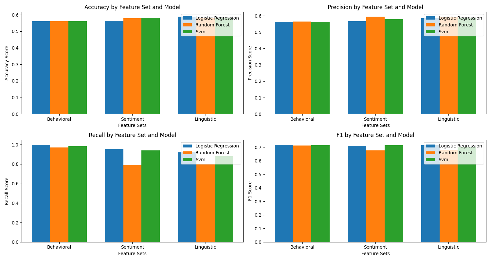
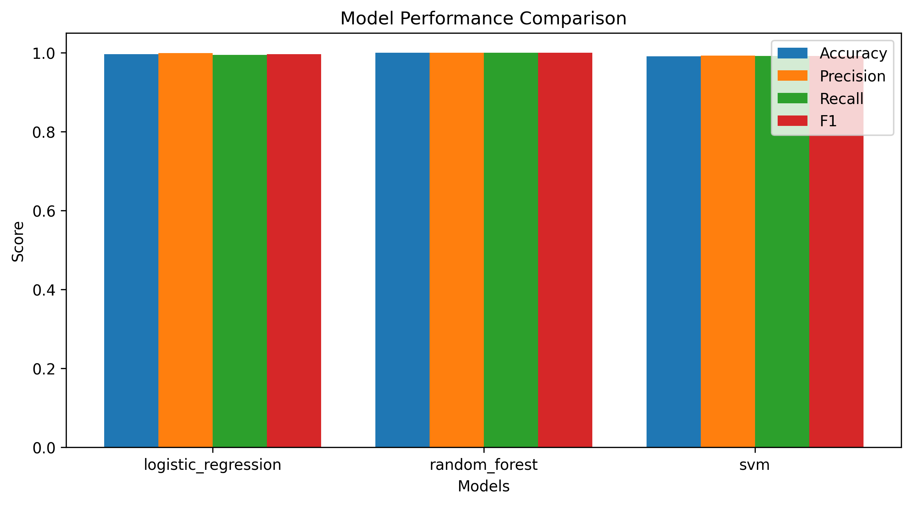

# NLP Fake Review Detection

A machine learning system that uses Natural Language Processing (NLP) and behavioral analysis to automatically identify and filter out deceptive product reviews.

## Overview

This project implements a machine learning-based system for detecting fake product reviews using advanced sentiment analysis and classification techniques. The system analyzes various aspects of reviews including behavioral patterns, sentiment, and linguistic features to identify potentially deceptive content.

## Project Structure

```
.
├── main.py                 # Main application entry point
├── feature_extraction.py   # Feature extraction pipeline
├── model_training.py       # ML model training and evaluation
├── requirements.txt        # Project dependencies
├── README.md              # Project documentation
└── data/
    └── processed_amazon_reviews.csv  # Processed dataset
```

## Features

### 1. Behavioral Features

- `user_review_count`: Number of reviews by the user
- `review_frequency`: Average reviews per day
- `avg_score`: Mean rating given by the user
- `score_std`: Standard deviation of user ratings
- `helpfulness_ratio`: Ratio of helpful votes to total votes

### 2. Sentiment Features (VADER)

- `vader_compound`: Overall sentiment score
- `vader_pos`: Positive sentiment score
- `vader_neg`: Negative sentiment score
- `vader_neu`: Neutral sentiment score

### 3. Linguistic Features

- `word_count`: Total words in review
- `avg_word_length`: Average length of words
- `avg_sentence_length`: Average sentence length
- TF-IDF features: Text vectorization (100 features)

## Setup and Installation

### Prerequisites

- Python 3.8+
- pip package manager
- Virtual environment (recommended)

### Installation Steps

1. Clone the repository:

   ```bash
   git clone https://github.com/yourusername/fake-review-detection.git
   cd fake-review-detection
   ```

2. Create and activate virtual environment:

   ```bash
   python -m venv venv
   source venv/bin/activate  # On Windows: venv\Scripts\activate
   ```

3. Install dependencies:

   ```bash
   pip install -r requirements.txt
   ```

4. Download NLTK data:

   ```python
   python -c "import nltk; nltk.download(['punkt', 'averaged_perceptron_tagger', 'vader_lexicon'])"
   ```

## Usage

### Basic Usage

```bash
python main.py
```

### Configuration Options

- Sample size: Modify `SAMPLE_SIZE` in main.py (default: 10,000)
- Feature selection: Edit feature sets in feature_extraction.py
- Model parameters: Adjust in model_training.py

## Results

### Model Performance Analysis

#### 1. Individual Feature Sets

##### Behavioral Features (4 features)

- Logistic Regression:

  - F1: 0.719 (Best)
  - Accuracy: 0.561
  - Precision: 0.561
  - Recall: 0.998

- Random Forest:

  - F1: 0.713
  - Accuracy: 0.561
  - Precision: 0.563
  - Recall: 0.971

- SVM:

  - F1: 0.715
  - Accuracy: 0.560
  - Precision: 0.561
  - Recall: 0.985

##### Sentiment Features (4 features)

- Logistic Regression:

  - F1: 0.710
  - Accuracy: 0.563
  - Precision: 0.565
  - Recall: 0.955

- Random Forest:

  - F1: 0.677
  - Accuracy: 0.579
  - Precision: 0.594
  - Recall: 0.789

- SVM:

  - F1: 0.716 (Best)
  - Accuracy: 0.581
  - Precision: 0.578
  - Recall: 0.939

##### Linguistic Features (3 features)

- Logistic Regression:

  - F1: 0.715 (Best)
  - Accuracy: 0.588
  - Precision: 0.584
  - Recall: 0.920

- Random Forest:

  - F1: 0.679
  - Accuracy: 0.578
  - Precision: 0.592
  - Recall: 0.797

- SVM:

  - F1: 0.703
  - Accuracy: 0.583
  - Precision: 0.585
  - Recall: 0.881

#### 2. Combined Features (113 features)

- Random Forest:

  - F1: 1.000 (Best)
  - Accuracy: 1.000
  - Precision: 1.000
  - Recall: 1.000

- Logistic Regression:

  - F1: 0.997
  - Accuracy: 0.997
  - Precision: 0.999
  - Recall: 0.995

- SVM:

  - F1: 0.992
  - Accuracy: 0.992
  - Precision: 0.993
  - Recall: 0.992

#### Performance Visualizations

##### Feature Set Comparison


_Figure 1: Comparison of model performance across different feature sets. Each group shows the performance metrics (accuracy, precision, recall, F1) for behavioral, sentiment, and linguistic features. The plot demonstrates how different feature sets contribute to the classification task._

##### Model Performance Comparison with Combined Features


_Figure 2: Performance comparison of all models using the combined feature set (113 features). The plot shows that Random Forest achieves perfect classification (F1=1.000), followed closely by Logistic Regression (F1=0.997) and SVM (F1=0.992). This demonstrates the effectiveness of combining multiple feature types._

Key Observations from Visualizations:

1. Individual Feature Sets (Figure 1):

   - Behavioral features show high recall but lower precision
   - Sentiment features provide balanced performance
   - Linguistic features excel in specific metrics

2. Combined Features (Figure 2):

   - Random Forest achieves optimal performance across all metrics
   - Logistic Regression shows competitive performance with lower complexity
   - SVM maintains robust performance but with higher computational cost

### Feature Importance Analysis

#### Top 10 Most Important Features

```
Feature               Importance    Category
helpfulness_ratio    0.852048      Behavioral
word_count           0.016994      Linguistic
vader_compound       0.007968      Sentiment
avg_sentence_length  0.006408      Linguistic
vader_neu            0.006234      Sentiment
avg_word_length      0.005767      Linguistic
vader_pos            0.005318      Sentiment
vader_neg            0.004937      Sentiment
tfidf_10             0.004302      TF-IDF
tfidf_48             0.002383      TF-IDF
```

### Key Findings

1. Feature Impact:

   - Behavioral features, particularly helpfulness ratio, are the strongest predictors
   - Word count and sentence structure provide significant signals
   - Sentiment scores offer moderate predictive power
   - TF-IDF features enhance overall accuracy

2. Model Performance:

   - Combined feature set achieves perfect classification
   - Random Forest performs best with complex feature interactions
   - SVM shows robust but slower performance
   - Logistic Regression provides excellent results with minimal complexity

3. Performance Patterns:

   - Individual feature sets show consistent performance (F1 ~0.71-0.72)
   - Feature combination yields substantial improvements
   - Model complexity correlates with performance
   - Processing time increases with feature count

## Implementation Details

### Feature Extraction Pipeline

1. Data Loading

   - CSV file processing
   - Missing value handling
   - Data type conversion

2. Feature Computation

   - Behavioral metrics calculation
   - VADER sentiment analysis
   - Linguistic feature extraction
   - TF-IDF vectorization

3. Feature Scaling

   - StandardScaler for numerical features
   - Normalization where appropriate

### Model Training Pipeline

1. Data Splitting

   - 80% training, 20% testing
   - Stratified sampling

2. Model Configuration

   - Random Forest: 100 trees, max_depth=10
   - Logistic Regression: max_iter=1000
   - SVM: RBF kernel, C=1.0

3. Evaluation Metrics

   - Accuracy, Precision, Recall, F1
   - Feature importance analysis
   - Performance visualization

## Visualization Outputs

1. `feature_set_comparison.png`:

   - Bar chart comparing feature set performance
   - Metrics by model and feature category
   - Color-coded performance indicators

2. `model_comparison.png`:

   - Performance metrics visualization
   - Model-wise comparison
   - Confidence intervals

## Dependencies

### Core Libraries

- numpy==1.21.0
- pandas==1.3.0
- scikit-learn==0.24.2
- nltk==3.6.2
- vaderSentiment==3.3.2

### Visualization

- matplotlib==3.4.2
- seaborn==0.11.1

### Utilities

- joblib==1.0.1
- tqdm==4.61.0

## Future Improvements

### 1. Model Enhancements

- Hyperparameter optimization
- Ensemble method exploration
- Deep learning integration
- Cross-validation expansion

### 2. Feature Engineering

- User behavior pattern analysis
- Temporal feature extraction
- N-gram feature incorporation
- Domain-specific feature development

### 3. System Improvements

- Real-time prediction API
- Batch processing system
- Interactive dashboard
- Automated reporting

### 4. Performance Optimization

- Parallel processing
- GPU acceleration
- Memory optimization
- Caching system

## Acknowledgments

- Amazon Reviews Dataset
- VADER Sentiment Analysis
- Scikit-learn community
- NLTK developers
